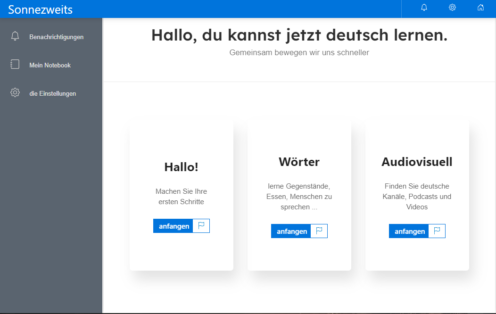

# Projeto de website sobre lingua alemã

Projeto de site em desenvolvimento com duplo objetivo: de aprendizado e também de divulgação de conhecimento.

## Preview

## Tecnologias usadas

> React.js / Next.js

## Linguagens

> Typescript

> SASS

